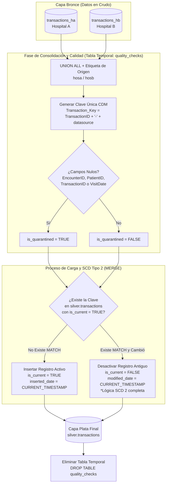

# MANUAL DE PROCESAMIENTO: CAPA BRONCE A PLATA EN BIGQUERY
## Modelo de Datos Común (CDM), Calidad de Datos (Cuarentena) y SCD Tipo 2

> [!NOTE]
> ### 📍 Ubicación del Código y Scripts SQL
> Los scripts SQL que ejecutan estas transformaciones en BigQuery se ubican en:
> * **Definición de Capa Bronce (Tablas Externas):** [data/BQ/bronze.sql](../data/BQ/bronze.sql)
> * **Transformación a Capa Plata (CDM, SCD 2, Cuarentenas):** [data/BQ/silver.sql](../data/BQ/silver.sql)
>
> ### ⚙️ Cómo Ejecutar
> Estos scripts se ejecutan en BigQuery de forma secuencial. Puedes correrlos manualmente en la consola de BigQuery o a través de la herramienta de línea de comandos `bq`:
> ```bash
> bq query --use_legacy_sql=false < data/BQ/bronze.sql
> bq query --use_legacy_sql=false < data/BQ/silver.sql
> ```

Este manual describe en profundidad el flujo de procesamiento lógico en **BigQuery** desde la **Capa Bronce** (donde se encuentran las tablas externas en crudo) hacia la **Capa Plata** (Cleaned, Integrated & History). Se detallan las transformaciones lógicas, las reglas de unificación de fuentes de datos y las técnicas avanzadas para el manejo de historia del negocio.

---

## 📖 Tabla de Contenidos
1. [Objetivos de la Capa Plata](#1-objetivos-de-la-capa-plata)
2. [Modelo de Datos Común (CDM) y Claves Sustitutas](#2-modelo-de-datos-común-cdm-y-claves-sustitutas)
3. [Controles de Calidad y Columnas de Cuarentena](#3-controles-de-calidad-y-columnas-de-cuarentena)
4. [Estrategia 1: Carga Completa (Truncate & Load)](#4-estrategia-1-carga-completa-truncate--load)
5. [Estrategia 2: Carga Incremental con SCD Tipo 2 (Slowly Changing Dimensions)](#5-estrategia-2-carga-incremental-con-scd-tipo-2-slowly-changing-dimensions)
6. [Implementación del MERGE en BigQuery para SCD Tipo 2](#6-implementación-del-merge-en-bigquery-para-scd-tipo-2)
7. [Flujo logico d ela carga Incremental](#7-Logico-de-la-carga-incremental)
---

## 1. Objetivos de la Capa Plata

Mientras que la capa bronce almacena los datos brutos de manera aislada (por ejemplo, tablas separadas para Hospital A y Hospital B), la **Capa Plata** persigue la consolidación corporativa de la información:

```
                  ┌───────────────────────┐
                  │ CAPA BRONCE (Crudo)   │
                  │ - hospital_a.patients │
                  │ - hospital_b.patients │
                  └───────────┬───────────┘
                              │
                              ▼ Limpieza, Unificación, Historial (SCD2)
                  ┌───────────────────────┐
                  │ CAPA PLATA (Limpios)  │
                  │ - silver.patients     │ (Tabla Única Unificada)
                  └───────────────────────┘
```

* **Unificación de Esquemas (CDM):** Integrar datos procedentes de sistemas heterogéneos bajo una misma estructura lógica de base de datos.
* **Limpieza y Consistencia:** Homologar tipos de datos, limpiar cadenas vacías, dar formato a fechas y gestionar valores nulos de forma estandarizada.
* **Preservación del Historial (SCD Tipo 2):** Rastrear y conservar el historial de cambios en las dimensiones (por ejemplo, cambios de seguro de salud o cambios de dirección de un paciente) en lugar de sobrescribirlos.

---

## 2. Modelo de Datos Común (CDM) y Claves Sustitutas

En un datalake multi-hospitalario es común que se presenten **llaves primarias colisionadas**. Por ejemplo, el Paciente ID `1` en el Hospital A representa a una persona y el Paciente ID `1` en el Hospital B representa a otra totalmente distinta. 

Para solucionar esto e integrar la información en una sola tabla, generamos una **Clave Única del Modelo Común de Datos (CDM Key)** concatenando el ID operacional de origen con la procedencia del dato:

$$\text{Clave del Paciente} = \text{ID del Paciente de Origen} + \text{"-"} + \text{Sistema de Origen}$$

### Ejemplo de Mapeo CDM:
* **Hospital A (HSA):** `patient_id` = `101` $\longrightarrow$ `patient_key` = `HCA-101`
* **Hospital B (HSB):** `patient_id` = `101` $\longrightarrow$ `patient_key` = `HCB-101`

```sql
-- Generación de la Clave Sustituta en BigQuery
SELECT 
  CONCAT(source_system, '-', src_patient_id) AS patient_key,
  src_patient_id,
  first_name,
  last_name,
  source_system
FROM `avd-databricks-demo.bronze_dataset.patients_ha`;
```

---

## 3. Controles de Calidad y Columnas de Cuarentena

Para no detener la ejecución del pipeline por inconsistencias en los datos operacionales de origen (calidad de datos), implementamos una estrategia de **Cuarentena**.

Añadimos un flag booleano `is_quarantined` a nivel de la capa plata. Si un registro clave posee valores nulos en campos mandatorios de negocio (como el ID del paciente, su nombre o apellido), el registro se inserta, pero es marcado como en cuarentena (`true`).

```sql
-- Lógica SQL para determinar cuarentena
CASE 
  WHEN patient_id IS NULL OR first_name IS NULL OR last_name IS NULL THEN true 
  ELSE false 
END AS is_quarantined
```

> [!TIP]
> **Beneficio de la Cuarentena:** Evita la pérdida de registros financieros importantes en la capa de detalle, pero permite que los analistas de negocio en la **Capa Oro** excluyan fácilmente los datos corruptos utilizando un simple filtro: `WHERE is_quarantined = false`.

---

## 4. Estrategia 1: Carga Completa (Truncate & Load)

Para las tablas que representan catálogos estables o de bajo volumen (como `departments` y `providers`), aplicamos una estrategia de **Carga Completa (Full Load)**. En cada ejecución:
1. Se limpia y unifica la información mediante un bloque `UNION ALL`.
2. Se vacía la tabla destino en la Capa Plata mediante `TRUNCATE TABLE`.
3. Se insertan todos los registros resultantes.

### Ejemplo de Query DML para Departamentos:
```sql
-- 1. Vaciar tabla destino
TRUNCATE TABLE `avd-databricks-demo.silver_dataset.departments`;

-- 2. Insertar datos unificados y formateados
INSERT INTO `avd-databricks-demo.silver_dataset.departments`
SELECT DISTINCT
  CONCAT('HSA-', dep_id) AS department_key,
  dep_id AS src_department_id,
  dep_name,
  'HSA' AS source_system,
  -- Validar cuarentena
  CASE WHEN dep_id IS NULL OR dep_name IS NULL THEN true ELSE false END AS is_quarantined,
  CURRENT_DATETIME('America/Lima') AS fec_proceso
FROM `avd-databricks-demo.bronze_dataset.departments_ha`

UNION ALL

SELECT DISTINCT
  CONCAT('HSB-', dep_id) AS department_key,
  dep_id AS src_department_id,
  dep_name,
  'HSB' AS source_system,
  CASE WHEN dep_id IS NULL OR dep_name IS NULL THEN true ELSE false END AS is_quarantined,
  CURRENT_DATETIME('America/Lima') AS fec_proceso
FROM `avd-databricks-demo.bronze_dataset.departments_hb`;
```

---

## 5. Estrategia 2: Carga Incremental con SCD Tipo 2 (Slowly Changing Dimensions)

Para las dimensiones que cambian con el tiempo (como la información de seguros o ubicación de los pacientes), debemos hacer un seguimiento histórico. El tipo **SCD 2** permite crear múltiples filas para el mismo paciente, delimitando su vigencia mediante rangos de fechas:

### Ejemplo de Evolución Histórica de un Paciente:

**Día 1: Ingesta del Paciente 101 con residencia en Hyderabad**
| patient_key | name | city | start_date | end_date | is_current |
| :--- | :--- | :--- | :---: | :---: | :---: |
| `HCA-101` | Ravi | Hyderabad | `2026-03-25` | `NULL` | `true` |

**Día 2: El paciente 101 se muda a Chennai**
El sistema operativo actualiza la dirección en MySQL. El pipeline detecta la modificación y:
1. **Cierra (desactiva)** el registro histórico viejo estableciendo su `end_date` y marcando `is_current = false`.
2. **Abre (crea)** un nuevo registro activo con la información actualizada y `is_current = true`.

| patient_key | name | city | start_date | end_date | is_current |
| :--- | :--- | :--- | :---: | :---: | :---: |
| `HCA-101` | Ravi | Hyderabad | `2026-03-25` | `2026-03-26` | `false` |
| `HCA-101` | Ravi | Chennai | `2026-03-26` | `NULL` | `true` |

---

## 6. Implementación del MERGE en BigQuery para SCD Tipo 2

Para lograr esta lógica de inserción y actualización simultánea (Upsert histórico) en BigQuery, se utiliza la sentencia **`MERGE`**. 

El proceso requiere comparar nuestra tabla temporal de datos nuevos (procedente de los controles de calidad/bronce del día) contra la tabla destino de la Capa Plata.

### Estructura de la Query MERGE para Pacientes (SCD Tipo 2):

```sql
MERGE `avd-databricks-demo.silver_dataset.patients` AS target
USING (
  -- Seleccionar datos entrantes con su clave única
  SELECT 
    CONCAT(source_system, '-', patient_id) AS patient_key,
    patient_id AS src_patient_id,
    first_name,
    last_name,
    dob,
    gender,
    state,
    insurance,
    source_system,
    is_quarantined
  FROM `avd-databricks-demo.temp_dataset.quarantine_patients_temp`
) AS source
ON target.patient_key = source.patient_key

-- CASO A: Actualización histórica (El registro existe, cambió un atributo, y está activo en destino)
-- Cerramos el registro actual poniendo is_current a false y asignando la fecha de fin de vigencia
WHEN MATCHED AND target.is_current = true AND (
  target.state <> source.state OR 
  target.insurance <> source.insurance
) THEN
  UPDATE SET 
    target.end_date = CURRENT_DATE(),
    target.is_current = false

-- CASO B: Inserción de nuevos pacientes
-- Si el registro no se encuentra en el destino, se crea desde cero como activo
WHEN NOT MATCHED THEN
  INSERT (
    patient_key,
    src_patient_id,
    first_name,
    last_name,
    dob,
    gender,
    state,
    insurance,
    source_system,
    start_date,
    end_date,
    is_current,
    is_quarantined,
    fec_proceso
  )
  VALUES (
    source.patient_key,
    source.src_patient_id,
    source.first_name,
    source.last_name,
    source.dob,
    source.gender,
    source.state,
    source.insurance,
    source.source_system,
    CURRENT_DATE(),
    NULL,
    true,
    source.is_quarantined,
    CURRENT_DATETIME('America/Lima')
  );
```

> [!IMPORTANT]
> **El proceso en dos fases para SCD Tipo 2:**
> La sentencia `MERGE` en BigQuery se ejecuta en dos pasos orquestados:
> 1. Primero se realiza el `MERGE` de actualización anterior (para cambiar `is_current` a `false` en los registros modificados).
> 2. Posterior a esto, se ejecuta un `INSERT` con los nuevos registros históricos activos (`is_current = true`) para aquellas claves cuyas versiones anteriores acaban de ser desactivadas. Esto garantiza que convivan ambas filas (la versión antigua inactiva y la versión nueva activa).
## 7 Logico de la carga incremental 
