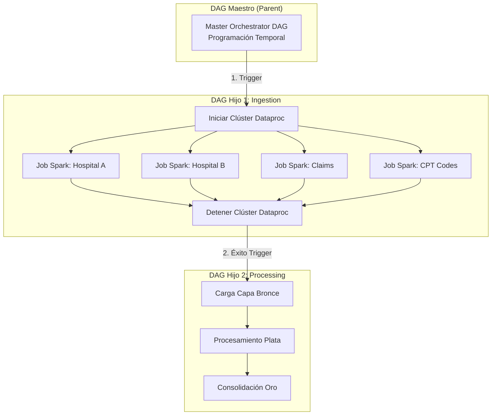

# MANUAL DE ORQUESTACIÓN Y AUTOMATIZACIÓN: APACHE AIRFLOW & CLOUD COMPOSER
## Orquestación del Pipeline de Ingesta (PySpark/Dataproc) y Procesamiento (BigQuery)

> [!NOTE]
> ### 📍 Ubicación del Código y DAGs de Airflow
> Los archivos Python que definen los DAGs de orquestación en Cloud Composer se ubican en:
> * **DAG Maestro (Orquestador Padre):** [workflows/parent_dag.py](../workflows/parent_dag.py)
> * **DAG de Ingesta PySpark (Hijo 1):** [workflows/pyspark_dag.py](../workflows/pyspark_dag.py)
> * **DAG de Transformación SQL (Hijo 2):** [workflows/bq_dag.py](../workflows/bq_dag.py)
>
> ### ⚙️ Cómo Ejecutar
> Estos DAGs se cargan en la carpeta `/dags/` del bucket de Cloud Composer y se controlan desde la interfaz web de Airflow. El DAG Padre se ejecuta automáticamente en su horario programado (`schedule_interval`), pero puedes dispararlo manualmente en la UI de Airflow o a través del comando `gcloud`:
> ```bash
> gcloud composer environments run [COMPOSER_ENV_NAME] \
>     --location [COMPOSER_LOCATION] \
>     dags trigger -- parent_orchestrator
> ```

Este manual detalla la **Fase 3: Orquestación del Pipeline** utilizando **Google Cloud Composer** (el servicio totalmente administrado de **Apache Airflow** en GCP). Se explica la arquitectura de orquestación basada en el patrón de diseño **Padre e Hijos (Parent-Child DAGs)** para automatizar la ejecución de jobs en Spark y consultas SQL en BigQuery de forma secuencial y sin intervención manual.

---

## 📖 Tabla de Contenidos
1. [Introducción a la Orquestación con Cloud Composer](#1-introducción-a-la-orquestación-con-cloud-composer)
2. [Aprovisionamiento: Cómo Crear el Entorno de Airflow (Cloud Composer)](#2-aprovisionamiento-cómo-crear-el-entorno-de-airflow-cloud-composer)
3. [Estrategia de Diseño: Patrón de Orquestación Parent-Child](#3-estrategia-de-diseño-patrón-de-orquestación-parent-child)
4. [Paso 1: El DAG de Ingesta - PySpark (Dataproc)](#paso-1-el-dag-de-ingesta---pyspark-dataproc)
5. [Paso 2: El DAG de Base de Datos - Procesamiento (BigQuery)](#paso-2-el-dag-de-base-de-datos---procesamiento-bigquery)
6. [Paso 3: El DAG Maestro - Orquestador (Parent)](#paso-3-el-dag-maestro---orquestador-parent)
7. [Despliegue de DAGs y CI/CD en la Empresa](#7-despliegue-de-dags-y-cicd-en-la-empresa)

---

## 1. Introducción a la Orquestación con Cloud Composer

En un pipeline de ingeniería de datos empresarial, la ejecución de scripts no se hace de forma manual o aislada. El éxito de la carga analítica final depende de una secuencia lógica exacta:

```
[ Fuentes de Origen ] ──(Ingesta Spark)──> [ GCS Landing ] ──(DML BigQuery)──> [ Capas Plata y Oro ]
```

Para coordinar esto, GCP provee **Cloud Composer**, que implementa **Apache Airflow**. Permite programar, programar alarmas de error, monitorear la infraestructura y encadenar dependencias mediante flujos de trabajo definidos como código Python (**DAGs** - *Directed Acyclic Graphs*).

---

## 2. Aprovisionamiento: Cómo Crear el Entorno de Airflow (Cloud Composer)

Para desplegar Apache Airflow de manera nativa y totalmente administrada en GCP utilizamos **Managed Airflow (Gen 3)** — anteriormente llamado **Cloud Composer 3** (documentación oficial: https://docs.cloud.google.com/composer/docs/composer-3/create-environments). A continuación, se detallan los prerrequisitos y los dos métodos para crearlo:

### Prerrequisitos (una sola vez por proyecto)

1. **Habilitar la API de Composer:**
   ```bash
   gcloud services enable composer.googleapis.com
   ```
2. **Cuenta de Servicio con roles IAM:** El entorno se ejecuta con una cuenta de servicio (ej. `my-service-account@project-id.iam.gserviceaccount.com`) que debe tener los siguientes roles para poder orquestar los componentes del pipeline:
   * **Composer Worker** (`roles/composer.worker`): Necesario para el funcionamiento interno del motor Airflow.
   * **Editor de Dataproc** (`roles/dataproc.editor`): Permite encender, apagar y enviar jobs de PySpark al clúster de Dataproc.
   * **Administrador de Storage** (`roles/storage.admin`): Permite leer/escribir datos en la Landing Zone de GCS.
   * **Administrador de BigQuery** (`roles/bigquery.admin`): Permite ejecutar queries y crear tablas en BigQuery.

   ```bash
   # Ejemplo: otorgar el rol Composer Worker a la cuenta de servicio
   gcloud projects add-iam-policy-binding PROJECT_ID \
       --member "serviceAccount:my-service-account@PROJECT_ID.iam.gserviceaccount.com" \
       --role roles/composer.worker
   ```

### Método A: Creación desde la Consola Web de GCP

1. **Ingresa al Servicio:** En la consola de GCP, busca **Composer / Managed Airflow** en la barra de búsqueda superior y haz clic en **Crear Entorno** > **Managed Airflow (Gen 3)** (recomendado por Google; el aprovisionamiento es serverless y ya no expone el clúster GKE como en Composer 2).
2. **Parámetros Básicos:**
   * **Nombre del entorno:** `us-central1-healthcare-composer-bucket` (debe iniciar con minúscula, máx. 62 caracteres y ser válido como nombre de bucket de GCS).
   * **Región:** `us-east1` o `us-central1` (debe ser la misma región donde residen tus buckets de GCS y BigQuery para evitar cargos por transferencia de datos inter-regionales).
3. **Configuración de Componentes y Versiones:**
   * **Versión de Imagen:** Obligatoria para Gen 3. Selecciona la última versión disponible con formato `composer-3-airflow-X.Y.Z-build.N` (ej. `composer-3-airflow-2.11.1-build.11`).
   * **Tamaño del entorno (Scale):** Selecciona **Small** (Pequeño) para entornos de desarrollo y pruebas. Esto aprovisionará recursos mínimos y mantendrá los costos bajos.
4. **Cuenta de Servicio:** Selecciona la cuenta de servicio preparada en los prerrequisitos.
5. Haz clic en **Crear**. *(La creación del entorno tarda aproximadamente 25 minutos)*.

---

### Método B: Creación Rápida mediante Cloud Shell (Línea de Comandos)

Si deseas realizar la creación de forma rápida y automatizada sin tener que pasar por la interfaz gráfica, abre **Cloud Shell** y ejecuta el siguiente comando `gcloud`:

```bash
gcloud composer environments create us-central1-healthcare-composer-bucket \
    --location us-east1 \
    --image-version composer-3-airflow-2.11.1-build.11 \
    --environment-size small \
    --service-account "my-service-account@project-d92eee7b-8c90-4381-b63.iam.gserviceaccount.com" \
    --project project-d92eee7b-8c90-4381-b63
```

> [!IMPORTANT]
> El flag `--image-version` es **obligatorio** con el formato `composer-3-airflow-X.Y.Z-build.N`; si lo omites, `gcloud` crea un entorno de la generación anterior (Composer 2). Lista las versiones disponibles con:
> ```bash
> gcloud composer environments list-upgrades --location us-east1 2>/dev/null || \
> gcloud beta composer environments list-image-versions --location us-east1
> ```

Para verificar el estado del entorno una vez lanzada la creación:

```bash
gcloud composer environments describe us-central1-healthcare-composer-bucket \
    --location us-east1 --format="value(state)"
```

> [!TIP]
> **El Bucket de Composer:**
> Cuando Cloud Composer se crea con éxito, GCP aprovisiona automáticamente un bucket especial de Google Cloud Storage dedicado a ese entorno. Toda la sincronización de tus DAGs y plugins se realiza copiando los archivos directamente a las carpetas `/dags/` y `/data/` de este bucket de GCS auto-generado.

---

## 3. Estrategia de Diseño: Patrón de Orquestación Parent-Child

En lugar de construir un único DAG gigante y monolítico que contenga todas las tareas del clúster de Spark y del almacén de BigQuery, se adopta un diseño **modular y desacoplado**:



### Beneficios del Patrón Parent-Child:
* **Mantenibilidad:** Si falla un script SQL en BigQuery, podemos re-ejecutar solo la sección de base de datos sin necesidad de volver a encender el clúster de Dataproc ni repetir la ingesta JDBC desde MySQL.
* **Desacoplamiento:** Los DAGs hijos no tienen programación horaria propia (`schedule_interval=None`). El DAG Padre es el único que posee la programación de tiempo (ej. diariamente a la 1:00 AM) y activa secuencialmente a los hijos.

---

## Paso 1: El DAG de Ingesta - PySpark (Dataproc)

Este DAG (`child_pyspark_ingestion.py`) se encarga de encender la infraestructura transitoria de Dataproc, enviar los cuatro (4) trabajos de ingesta y apagar el clúster al finalizar para evitar costos redundantes:

```python
from airflow import DAG
from airflow.providers.google.cloud.operators.dataproc import (
    DataprocStartClusterOperator,
    DataprocSubmitJobOperator,
    DataprocDeleteClusterOperator,
)
from datetime import datetime, timedelta

# Configuración base del flujo
default_args = {
    'owner': 'GTM-Digitales',
    'start_date': datetime(2026, 3, 25),
    'retries': 1,
    'retry_delay': timedelta(minutes=5)
}

with DAG(
    'child_pyspark_ingestion',
    default_args=default_args,
    schedule_interval=None,  # Activado por el padre
    catchup=False
) as dag:

    # 1. Tarea para iniciar un clúster Dataproc existente para ahorrar recursos
    start_dataproc_cluster = DataprocStartClusterOperator(
        task_id='start_dataproc_cluster',
        project_id='avd-databricks-demo',
        region='us-central1',
        cluster_name='my-demo-cluster2'
    )

    # 2. Configuración y envío de Jobs de Spark (Ejemplo: Hospital A)
    pyspark_job_hosa = {
        'reference': {'project_id': 'avd-databricks-demo'},
        'placement': {'cluster_name': 'my-demo-cluster2'},
        'pyspark_job': {'main_python_file_uri': 'gs://composer-bucket/data/hospitalA_mysqlToLanding.py'}
    }

    submit_job_hosa = DataprocSubmitJobOperator(
        task_id='submit_job_hospital_a',
        job=pyspark_job_hosa,
        region='us-central1',
        project_id='avd-databricks-demo'
    )

    # (Se repite la configuración para Hospital B, Claims y CPT Codes)

    # 3. Tarea para apagar el clúster y frenar la facturación de Compute Engine
    stop_dataproc_cluster = DataprocDeleteClusterOperator(
        task_id='stop_dataproc_cluster',
        project_id='avd-databricks-demo',
        region='us-central1',
        cluster_name='my-demo-cluster2'
    )

    # Secuencia de dependencias
    start_dataproc_cluster >> submit_job_hosa >> stop_dataproc_cluster
```

---

## Paso 2: El DAG de Base de Datos - Procesamiento (BigQuery)

Este DAG (`child_bigquery_processing.py`) no administra infraestructura física, sino que se comunica directamente con BigQuery para orquestar la transformación de las capas del Datalake:

```python
from airflow import DAG
from airflow.providers.google.cloud.operators.bigquery import BigQueryInsertJobOperator
from datetime import datetime

# Función para leer el archivo SQL alojado en GCS o local del Composer
def read_sql_query(filepath):
    with open(filepath, 'r') as file:
        return file.read()

with DAG(
    'child_bigquery_processing',
    start_date=datetime(2026, 3, 25),
    schedule_interval=None,
    catchup=False
) as dag:

    # 1. Procesamiento Bronce (Carga de tablas externas)
    run_bronze_layer = BigQueryInsertJobOperator(
        task_id='run_bronze_layer',
        configuration={
            "query": {
                "query": read_sql_query('/home/airflow/gcs/data/bronze.sql'),
                "useLegacySql": False,
            }
        }
    )

    # 2. Procesamiento Plata (Limpieza, CDM, SCD Tipo 2)
    run_silver_layer = BigQueryInsertJobOperator(
        task_id='run_silver_layer',
        configuration={
            "query": {
                "query": read_sql_query('/home/airflow/gcs/data/silver.sql'),
                "useLegacySql": False,
            }
        }
    )

    # 3. Procesamiento Oro (Hechos y Dimensiones de Resumen)
    run_gold_layer = BigQueryInsertJobOperator(
        task_id='run_gold_layer',
        configuration={
            "query": {
                "query": read_sql_query('/home/airflow/gcs/data/gold.sql'),
                "useLegacySql": False,
            }
        }
    )

    # Secuencia lógica
    run_bronze_layer >> run_silver_layer >> run_gold_layer
```

---

## Paso 3: El DAG Maestro - Orquestador (Parent)

El orquestador maestro (`parent_orchestrator.py`) contiene la lógica de programación horaria corporativa y encadena los dos procesos hijos utilizando el operador de disparadores:

```python
from airflow import DAG
from airflow.operators.trigger_dagrun import TriggerDagRunOperator
from datetime import datetime, timedelta

default_args = {
    'owner': 'GTM-Digitales',
    'start_date': datetime(2026, 3, 25),
    'retries': 1,
    'retry_delay': timedelta(minutes=10)
}

with DAG(
    'parent_orchestrator',
    default_args=default_args,
    schedule_interval='0 1 * * *',  # Ejecución diaria a la 1:00 AM (America/Lima)
    catchup=False
) as dag:

    # Disparar la ingesta en Spark de forma prioritaria
    trigger_pyspark = TriggerDagRunOperator(
        task_id='trigger_pyspark_ingestion',
        trigger_dag_id='child_pyspark_ingestion',
        wait_for_completion=True,  # Esperar a que el DAG hijo finalice con éxito
        poke_interval=30
    )

    # Disparar las consultas SQL en BigQuery una vez finalizada la ingesta
    trigger_bigquery = TriggerDagRunOperator(
        task_id='trigger_bigquery_processing',
        trigger_dag_id='child_bigquery_processing',
        wait_for_completion=True,
        poke_interval=30
    )

    # Dependencia global del Datalake
    trigger_pyspark >> trigger_bigquery
```

---

## 4. Despliegue de DAGs y CI/CD en la Empresa

En producción, los ingenieros de datos no cargan archivos manualmente a la interfaz de Airflow. Se utiliza un pipeline de Integración y Despliegue Continuo (**CI/CD**):

1. **Desarrollo y Commit:** El ingeniero escribe o modifica los DAGs en su entorno local y los sube a una rama de desarrollo en **GitHub**.
2. **Pipelines de Integración:** Un servicio de automatización (como GitHub Actions, Cloud Build o GitLab CI) valida la sintaxis de Python y los scripts SQL.
3. **Despliegue Automatizado a GCS:** Una vez aprobado el Pull Request en la rama `main`, el pipeline de CI/CD copia de forma automática:
   * Los archivos `.py` de los DAGs a la carpeta `/dags/` del bucket de Cloud Composer.
   * Los scripts auxiliares de transformación (`silver.sql`, `gold.sql`) y los scripts PySpark de extracción a la carpeta `/data/` del mismo bucket.
4. **Sincronización de Composer:** Cloud Composer detecta los nuevos archivos en su bucket asociado y actualiza la interfaz de Airflow en segundos de forma automática.
