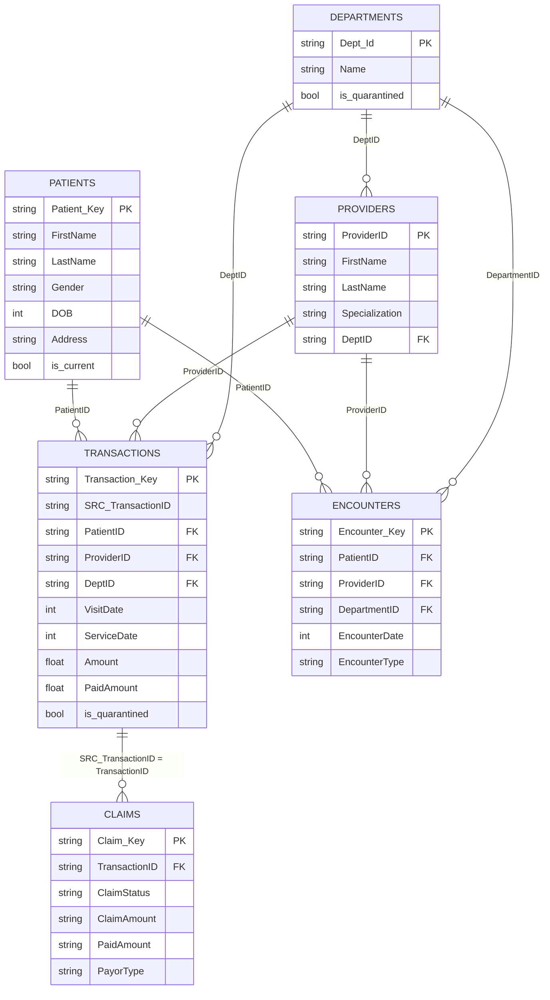
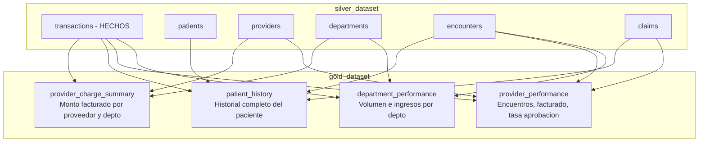
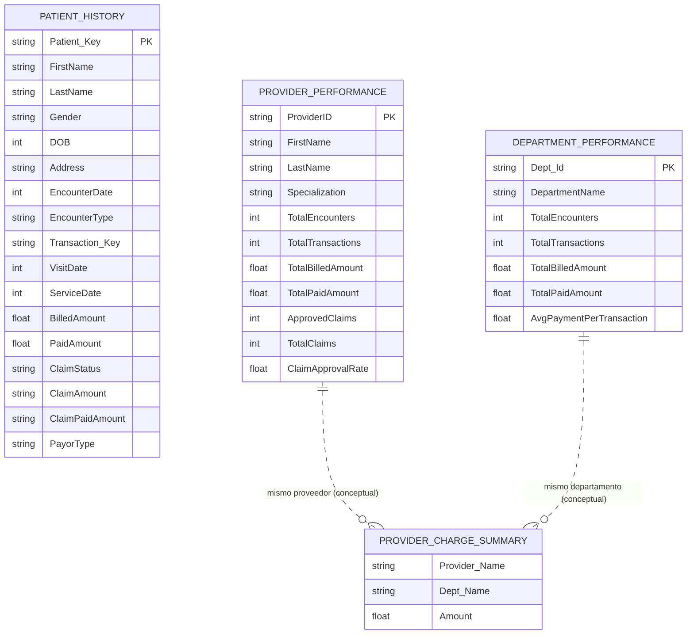

# Diagrama ER — Modelo Estrella (Capa Gold)

Modelo estrella derivado de `data/BQ/gold.sql`. La tabla de hechos central es `transactions` (silver), rodeada por las dimensiones `patients`, `providers`, `departments`, `encounters` y `claims`. Las 4 tablas gold son agregaciones construidas sobre este modelo.

## Modelo Estrella (capa Silver — fuente de Gold)

## Tablas Gold (agregaciones)

## Tablas finales Gold (solo gold_dataset)

Las tablas gold no tienen llaves foráneas entre sí: son agregaciones desnormalizadas e independientes. Las líneas punteadas indican relaciones conceptuales (comparten proveedor/departamento), no FKs reales.

> Nota: las tablas 5 (Métricas Financieras) y 6 (Desempeño de Pagadores) están declaradas en `gold.sql` solo como comentarios, aún sin implementar.
