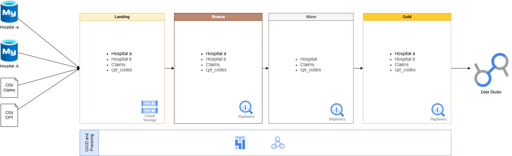

# End-to-End-GCP-sECTOR-Salud
- Implementación de mi pipeline con las tecnologías de GCP

### **Contexto General del Proyecto**

* **Objetivo:** Construir un flujo de datos (pipeline) de principio a fin utilizando Google Cloud Platform (GCP).
* **Dominio de Negocio:** Gestión del Ciclo de Ingresos en el sector Salud (RCM - *Revenue Cycle Management*).
* **Rol del Ingeniero de Datos:** Extraer datos de múltiples fuentes, crear procesos ETL (Extracción, Transformación y Carga) para limpiar la información y habilitar la creación de Dashboards, KPIs y reportes financieros.

### **1. Conceptos de Negocio: Gestión del Ciclo de Ingresos (RCM)**

Para ser un buen ingeniero de datos, primero debes entender la lógica del negocio. En el sector salud, el ciclo del dinero fluye de la siguiente manera:

1. **Visita del Paciente:** El paciente llega, se registran sus datos personales, información del seguro y método de pago (ej. copagos).
2. **Servicios Prestados:** El hospital y el **Proveedor** (médico) realizan chequeos, cirugías o tratamientos. Esto genera un registro único llamado **Encounter** (encuentro/visita histórica).
3. **Generación de Facturas:** Se calculan los costos basados en los servicios prestados y el proveedor involucrado.
4. **Pagos y Reclamaciones:** Se gestiona quién paga qué (la aseguradora, el paciente o ambos). Se hace seguimiento a la deuda.
5. **Documentación (Tracking):** Todo se almacena para garantizar la estabilidad financiera del hospital.

### **2. Fuentes de Datos (Data Sources)**

El proyecto extrae información de cuatro fuentes principales para construir el análisis:

* **Hospital A (Historial Médico Electrónico - EMR):** Alojado en una base de datos Cloud SQL. Contiene 5 tablas: Pacientes, Encounters (registros de visita), Proveedores (médicos), Departamentos y Transacciones.
* **Hospital B (EMR):** Alojado en otra base de datos Cloud SQL. Contiene las mismas 5 tablas, pero con su propio formato.
* **Reclamaciones (Claims):** Archivos CSV que llegan mensualmente con los datos de las aseguradoras (aprobaciones o rechazos de pagos).
* **Códigos CPT (Current Procedural Terminology):** Archivos CSV que contienen los códigos médicos estandarizados para describir diagnósticos y procedimientos.

*(Nota: Existen otros datos como NPI para identificar médicos y el estándar internacional ICD para enfermedades, pero el proyecto se enfoca en las cuatro fuentes anteriores).*

### **3. Arquitectura Técnica del Proyecto en GCP**
- Se implmento spark administrado para la caraga  de informacion y la orquestacion se dio mediante Airflow administrado

**Fase 1: Ingesta y Aterrizaje**

* **Herramienta de Ingesta:** **Google Cloud Dataproc**. Se conecta a las bases de datos (Cloud SQL) y lee los archivos planos (CSV).
* **Landing Layer (Capa de Aterrizaje):** **Google Cloud Storage (GCS)**. Los datos extraídos se guardan aquí en carpetas separadas, en su formato original (crudo).

**Fase 2: Procesamiento y Almacenamiento (BigQuery)**
Una vez en GCS, los datos pasan a la plataforma de análisis (BigQuery) utilizando la **Arquitectura Medallón**:

* **Capa Bronce (Bronze Layer):** Datos crudos cargados directamente desde la capa Landing hacia BigQuery en formato tabular. Es la "fuente de la verdad".
* **Capa Plata (Silver Layer):** Aquí ocurre la magia de la transformación.
  * Se limpian los datos.
  * Se aplica **SCD Tipo 2** (Slowly Changing Dimensions) para rastrear el historial de cambios correctamente.
  * Se crea un **Modelo de Datos Común**: Como el Hospital A y el Hospital B tienen identificadores distintos, aquí se unifican y estandarizan para que el análisis sea global.

* **Capa Oro (Gold Layer):** Tablas altamente refinadas y agregadas, diseñadas específicamente para responder a las preguntas de negocio (ej. ingresos por trimestre).

**Fase 3: Visualización (BI)**

* Las herramientas de Business Intelligence (Dashboards, Reportes) se conectan directamente a las tablas de la **Capa Oro** para que los gerentes tomen decisiones.

**Fase 4: Orquestación y Automatización**

* **Herramienta:** **Apache Airflow** y **Cloud Triggers**.
* Se encargan de automatizar todo el proceso para que no haya intervención manual. Ejecutan los trabajos de Dataproc, mueven los datos en BigQuery y mantienen el pipeline funcionando en los tiempos establecidos.

-- COnfiguracion para mi data proc
CLUSTER_NAME="my-demo-cluster2"
